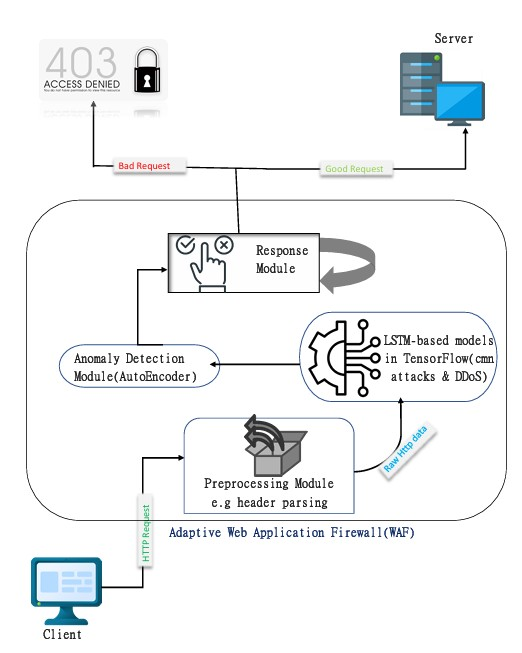

# 🚀 Adaptive Web Application Firewall (AWAF) using AI

## 📌 Introduction


Web security is a growing concern in modern applications. Our **Adaptive Web Application Firewall (AWAF)** enhances security by integrating **AI-powered LSTM models** to detect and mitigate **DDoS, SQL Injection, XSS, and other cyber threats**. AWAF dynamically adapts to evolving attack patterns, providing **real-time protection** with high accuracy.

🎯 **Why is our AWAF different?**
- We have achieved **high accuracy** by creating our own **custom dataset** for training.
- **AutoLearning capability** allows AWAF to improve continuously.
- **Combination of Machine Learning (ML) & Deep Learning (DL)** enhances attack detection.
- **Minimal user interaction required**, making it highly autonomous.

---

## 📖 Description
AWAF is designed to:
- ✅ **Analyze incoming HTTP requests** for anomalies and cyber threats.
- ✅ **Leverage deep learning (LSTM, AutoEncoders)** for real-time attack detection.
- ✅ **Block malicious requests** while allowing legitimate traffic to pass.
- ✅ **Provide an interactive dashboard** for monitoring security threats.
- ✅ **Detect anomalies dynamically** to enhance cybersecurity resilience.

### 🔥 AWAF Core Modules:
1. **Preprocessing Module**: Parses HTTP headers and extracts features.
2. **Machine Learning Detection**: Uses LSTM-based models for DDoS, SQLi, and XSS attack detection.
3. **Anomaly Detection Module**: Employs an AutoEncoder to flag unusual behaviors.
4. **Response Module**: Takes action based on attack classification.

---

## 🛠️ Installation Guide
### Prerequisites
Ensure you have the following installed:
- Python
- TensorFlow & Keras
- Node.js (for dashboard)
- Pandas, NumPy, Matplotlib (for data processing)
- Flask 

# Dependencies list with thier versions
```bash
Package                      Version
---------------------------- -----------
certifi                      2025.1.31
colorama                     0.4.6
cryptography                 44.0.1
Flask                        3.1.0
flatbuffers                  25.2.10
joblib                       1.4.2
kaitaistruct                 0.10
keras                        3.5.0
Keras-Preprocessing          1.1.2
MarkupSafe                   3.0.2
mdurl                        0.1.2
mitmproxy                    11.0.2
mitmproxy_rs                 0.10.7
mitmproxy-windows            0.10.7
ml-dtypes                    0.4.1
msgpack                      1.1.0
namex                        0.0.8
numpy                        1.26.4
oauthlib                     3.2.2
opt_einsum                   3.4.0
optree                       0.14.0
packaging                    24.2
pandas                       2.2.3
passlib                      1.7.4
pip                          25.0
protobuf                     3.20.3
publicsuffix2                2.20191221
pyasn1                       0.6.1
pyasn1_modules               0.4.1
pycparser                    2.22
pydivert                     2.1.0
Pygments                     2.19.1
pylsqpack                    0.3.19
pyOpenSSL                    24.3.0
pyparsing                    3.2.0
pyperclip                    1.9.0
python-dateutil              2.9.0.post0
pytz                         2025.1
requests                     2.32.3
requests-oauthlib            2.0.0
rich                         13.9.4
rsa                          4.9
scapy                        2.6.1
scikit-learn                 1.5.1
scipy                        1.15.2
sortedcontainers             2.4.0
tensorboard                  2.18.0
tensorboard-data-server      0.7.2
tensorboard-plugin-wit       1.8.1
tensorflow-cpu               2.18.0
tensorflow-estimator         2.10.0
tensorflow_intel             2.18.0
tensorflow-io-gcs-filesystem 0.31.0
```

### 🔧 Installation Steps
```bash
# Clone the repository
git clone https://github.com/shivajirathod007/Adaptive-WAF
cd Adaptive-WAF
```

```bash
# Install Python dependencies
pip install -r requirements.txt
```

```bash
# Start the AWAF backend
python module_main.py 
```

```bash
# Start the Proxy server
mitmdump -p 8081 -s proxy.py  
```

```bash
# Start the dashboard
npm start
```

---

## 🎯 Example: Testing AWAF
Try sending a malicious request (SQLI) using `curl`:
```bash
curl -x http://localhost:8081 -X POST "http://localhost:8000/login" -d "union select * from users"
```
Expected response:
```json
{"status": "Blocked", "reason": "SQL Injection Detected"}
```

You can also test using normal requests:
```bash
curl -x http://localhost:8081 -X POST "http://localhost:8000/login" -d "user=admin"
```
Expected response:
```json
{"status": "Allowed", "message": "Safe request"}
```

---

## 🏗️ Architecture


### 🔍 How It Works
1. **Client** 🖥️  
   - Sends an **HTTP request** to the server.

2. **Preprocessing Module** 🛠️  
   - Extracts key HTTP features (headers, body, parameters).
   - Converts raw HTTP data into a structured format for analysis.

3. **LSTM-based Machine Learning Model** 🤖  
   - Uses **Deep Learning (LSTM)** for detecting **DDoS, SQLi, XSS, and other attacks**.
   - Identifies patterns of normal vs. malicious traffic.

4. **Anomaly Detection Module (AutoEncoder)** ⚠️  
   - Flags **suspicious requests** that don't match normal traffic behavior.
   - Acts as an additional layer of security.

5. **Response Module** ✅❌  
   - **Blocks** malicious requests and returns a **403 Access Denied**.
   - **Allows** legitimate requests to reach the **server**.

6. **Server** 🖥️  
   - Receives only **safe HTTP/HTTPS requests**, ensuring **secure communication**.

7. **Dashboard** 📊  
   - **Logs detected attacks**, traffic stats, and system performance for monitoring.

This layered approach ensures **high security, real-time threat detection, and minimal performance impact**. 🚀

---

## 🎯 Advantages
- 🔥 **Real-time threat detection** with AI-powered deep learning models.
- ⚡ **Adaptive security** that evolves with new attack patterns.
- 📊 **Dashboard for administrators** to track security insights.
- 🔍 **Comprehensive attack detection** covering SQLi, XSS, DDoS, and anomalies.
- 🚀 **Lightweight & efficient**, ensuring minimal performance impact.

---

## 💡 Future Enhancements
- 🛡️ Integration with **Reinforcement Learning** for better attack pattern detection.
- 📡 Support for **Cloud-based WAF deployment**.
- 📌 Improved **logging and analytics** for security insights.
- 🔍 **Expanding ML models** to detect new vulnerabilities.

---

## 📜 License
This project is open-source and available under the **MIT License**.

---

## 🤝 Contributing
We welcome contributions! Feel free to submit issues or pull requests to enhance AWAF. 🔥

---

## 📞 Contact
For queries and support, reach out to:
📧 Email: shivaa.rathod007@gmail.com  
📧 Email: poojawavdara21@gmail.com  
📧 Email: harshadayele19@gmail.com  
📧 Email: prajwalsuryawanshi238@gmail.com  
🌐 GitHub: [ADAPTIVE-WAF](https://github.com/shivajirathod007/Adaptive-WAF)  

---

⭐ **Star this project on GitHub if you find it useful!** ⭐

